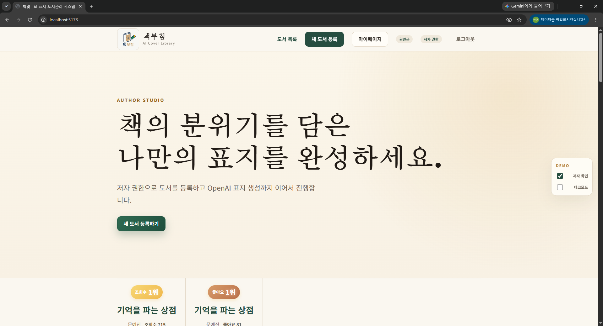
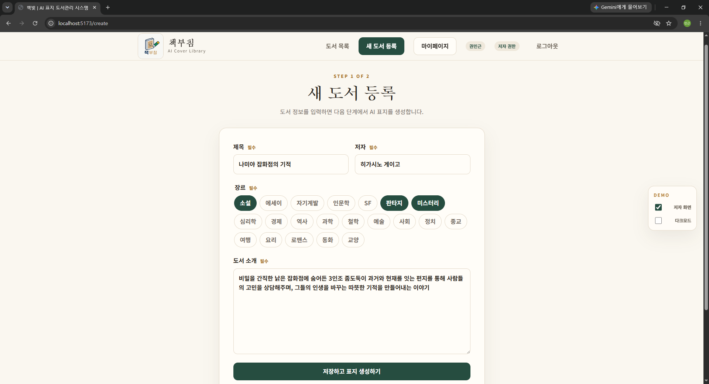
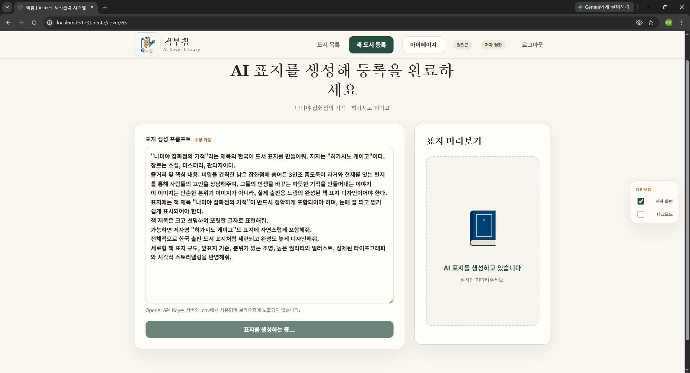
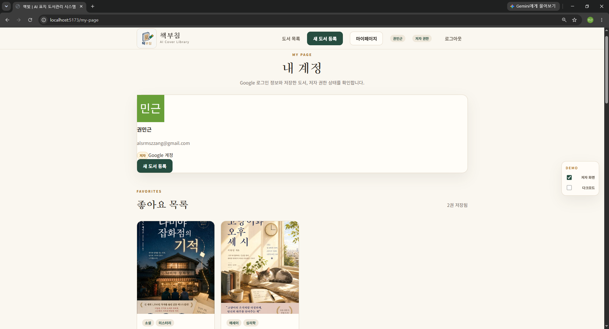
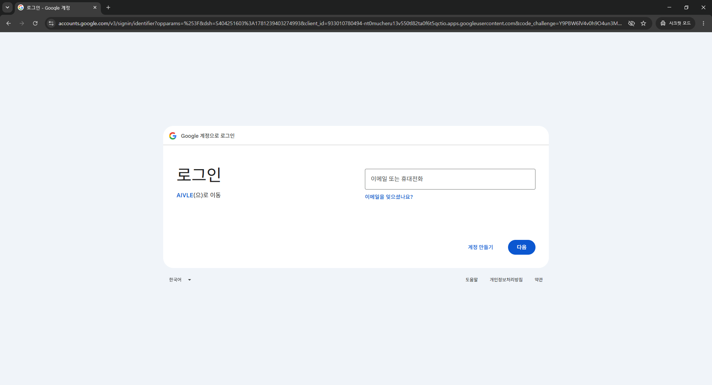
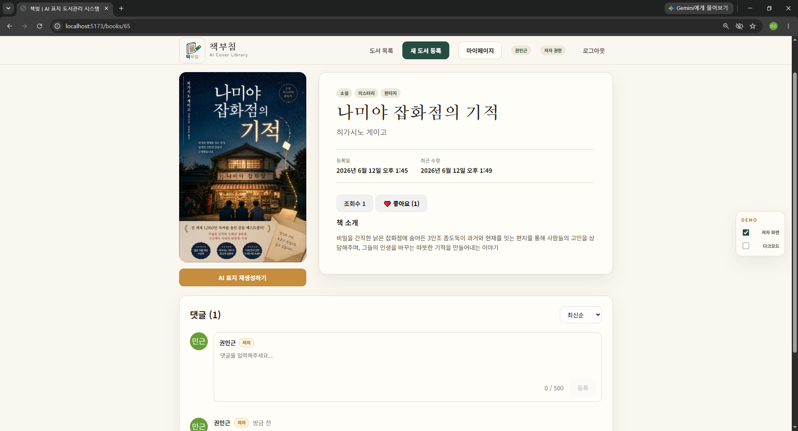
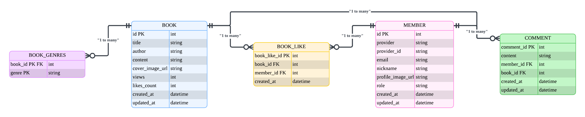

# 📚 책부침 (BookBuchim)


> **AI 표지 생성 기능이 탑재된 스마트 도서 관리 시스템**
## 📖 프로젝트 소개

책부침(BookBuchim)은 사용자가 직접 도서를 등록하고,
AI를 활용해 도서 표지를 생성할 수 있는 독서 커뮤니티 서비스입니다.

- Google OAuth2 로그인
- AI 기반 표지 생성
- 좋아요 및 댓글 기능
- 마이페이지 기반 개인 도서 관리
> React + Spring Boot + H2 Database + OpenAI + Google OAuth2
---

# 👨‍💻 기술 스택

### Frontend


### Backend


### Database


### AI


### Authentication


---

# 👥 팀 구성 및 역할 (R&R)

| 프로젝트 수행 역할 | 담당자 | 설명 |
|------------------|--------|------|
| PM / 기획 | 권민근 | ERD 설계, API 정의서 작성, README 작성, 발표 자료 준비, 통합 이슈 추적 |
| 백엔드 개발 (1) | 박지웅 | Book Entity 작성, BookRepository 구현, H2 콘솔 확인, Lombok 적용 |
| 백엔드 개발 (2) | 박승원, 이동건 | BookService 구현, 비즈니스 로직 작성, 예외 처리, @Transactional 적용 |
| 백엔드 개발 (3) | 김민성 | BookController 구현, CRUD API 개발, Validation 적용, Postman 테스트 |
| 통합 · 예외 처리 | 강혜원, 유승찬 | WebConfig(CORS), GlobalExceptionHandler, 통합 테스트, 트러블슈팅 |
| AI · Frontend 연동 | 정다영 | Frontend 코드 분석, API 연동, OpenAI 표지 생성 기능 구현, E2E 시연 준비 |

---
# ✨ 서비스 미리보기

## 📜 메인페이지


## 📚 도서 등록


## 🎨 AI 표지 생성


## 👤 마이페이지


<details>
<summary>추가 화면 보기</summary>

### 로그인


### 도서 상세


</details>

---

# 🚀 빠른 시작 (Windows)

## 1단계: `실행.bat` 파일 생성

프로젝트 루트 폴더(`book_backend/`)에 아래 내용으로 `실행.bat` 파일을 생성합니다.

```bat
@echo off
echo ==========================================
echo  Website & Server Starter
echo ==========================================

:: 1. 프론트엔드 실행 (새 창에서)
start "Frontend" cmd /k "cd /d %~dp0front && npm install && npm run dev"

:: 2. 백엔드 실행 (새 창에서)
start "Backend" cmd /k "cd /d %~dp0bookserver && gradlew bootRun"

echo ==========================================
echo Started! Check browser at http://localhost:5173
echo ==========================================
pause
```

## 2단계: 자동 실행

`실행.bat` 파일을 더블클릭합니다.

프론트엔드와 백엔드가 각각 새 창에서 자동으로 빌드 및 실행됩니다.

실행이 완료되면 브라우저에서 아래 주소로 접속합니다.

```text
http://localhost:5173
```

---

# ⚙️ 필수 사전 설정 (최초 1회)

프로젝트를 실행하기 전 다음 경로에 환경변수 파일을 생성해야 합니다.

### 파일 경로

```text
bookserver/.env
```

### 파일 내용

```properties
GOOGLE_CLIENT_ID=YOUR_GOOGLE_CLIENT_ID
GOOGLE_CLIENT_SECRET=YOUR_GOOGLE_CLIENT_SECRET
OPENAI_API_KEY=YOUR_OPENAI_API_KEY
```

---

# 🔑 API Key 발급처

### Google OAuth 2.0

Google Cloud Console

승인된 리디렉션 URI

```text
http://localhost:8080/login/oauth2/code/google
```

### OpenAI API

OpenAI Platform

---

# 🖥️ 수동 실행 방법 (실행.bat 미사용 시)

## ☕ Backend (Spring Boot)

```powershell
cd bookserver
.\gradlew.bat bootRun
```

## ⚛️ Frontend (React)

```bash
cd front
npm install
npm run dev
```

---

# 🌐 포트 및 접속 주소 정보

| 서비스         | 주소                               | 비고          |
| ----------- | -------------------------------- | ----------- |
| Frontend    | http://localhost:5173            | React 화면 구동 |
| Backend API | http://localhost:8080            | API 테스트     |
| H2 Console  | http://localhost:8080/h2-console | 인메모리 DB 관리  |

---

# 📊 H2 Database 접속 정보

```text
JDBC URL : jdbc:h2:mem:testdb
User Name : sa
Password : (공백)
```

---

# 🔗 주요 API 엔드포인트

| 메서드    | 엔드포인트                          | 설명          | 인증     |
| ------ | ------------------------------ | ----------- | ------ |
| GET    | /api/books                     | 도서 전체 목록 조회 | 공통     |
| GET    | /api/books/{id}                | 도서 상세 조회    | 공통     |
| POST   | /api/books                     | 도서 등록       | 공통     |
| PATCH  | /api/books/{id}                | 도서 수정       | 공통     |
| DELETE | /api/books/{id}                | 도서 삭제       | 공통     |
| GET    | /api/books/{bookId}/comments   | 댓글 목록 조회    | 공통     |
| POST   | /api/books/{bookId}/comments   | 댓글 작성       | 로그인 필요 |
| GET    | /api/members/me                | 현재 회원 조회    | 로그인 필요 |
| POST   | /api/members/me/author-request | 저자 권한 신청    | 로그인 필요 |
| POST   | /api/covers/generate           | AI 표지 생성    | 로그인 필요 |

---

# 🗄️ ERD



---

# 📁 프로젝트 디렉토리 구조

```text
book_backend/
├── 실행.bat
├── bookserver/
│   ├── src/main/java/com/aivle/bookserver/
│   │   ├── controller/
│   │   ├── service/
│   │   ├── domain/
│   │   ├── dto/
│   │   ├── repository/
│   │   └── config/
│   └── .env
└── front/
    └── src/
        ├── pages/
        ├── components/
        ├── api/
        └── styles/
```

### 디렉토리 설명

| 경로         | 설명                     |
| ---------- | ---------------------- |
| 실행.bat     | 프론트/백엔드 동시 실행          |
| controller | REST API 컨트롤러          |
| service    | 비즈니스 로직                |
| domain     | JPA 엔티티                |
| dto        | Request / Response DTO |
| repository | JPA Repository         |
| config     | Security, CORS 설정      |
| .env       | 로컬 환경변수 (Git 제외)       |

---

# 💡 트러블슈팅 가이드

## Q. npm 또는 node 명령어를 찾을 수 없다고 나옵니다.

Node.js(v18 이상 권장)가 설치되어 있는지 확인하고 환경변수를 점검하세요.

```bash
node -v
```

---

## Q. 도서 등록이 정상적으로 진행되지 않습니다.

백엔드가 정상 구동 중인지 확인합니다.

```text
http://localhost:8080/api/books
```

필수 입력값(제목, 저자, 장르, 소개)이 누락되지 않았는지 확인하세요.

---

## Q. 구글 로그인 후 메인 화면으로 이동하지 않습니다.

Google Cloud Console의 승인된 리디렉션 URI 설정을 확인하세요.

```text
http://localhost:8080/login/oauth2/code/google
```

또한 `.env` 파일의 OAuth 정보가 올바른지 확인하세요.

---

## Q. H2 Console에 테이블이 보이지 않습니다.

스프링 부트 서버를 재시작한 뒤 다시 접속해보세요.

`ddl-auto` 설정에 따라 애플리케이션 시작 시 테이블이 자동 생성됩니다.

---

# ✅ 최종 시연 체크리스트

* [ ] 실행.bat 클릭 시 프론트엔드와 백엔드가 모두 정상 실행되는가?
* [ ] http://localhost:5173 접속 시 메인 페이지가 정상 표시되는가?
* [ ] 구글 로그인 기능이 정상 동작하는가?
* [ ] 도서 등록 및 AI 표지 생성 기능이 정상 동작하는가?
* [ ] 댓글 작성/수정/삭제가 DB에 정상 반영되는가?
* [ ] H2 Console에서 데이터 확인이 가능한가?


