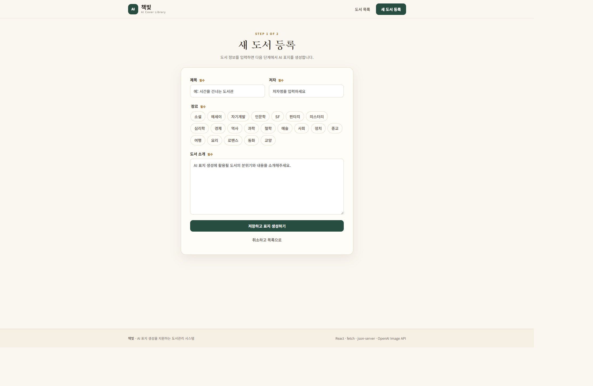
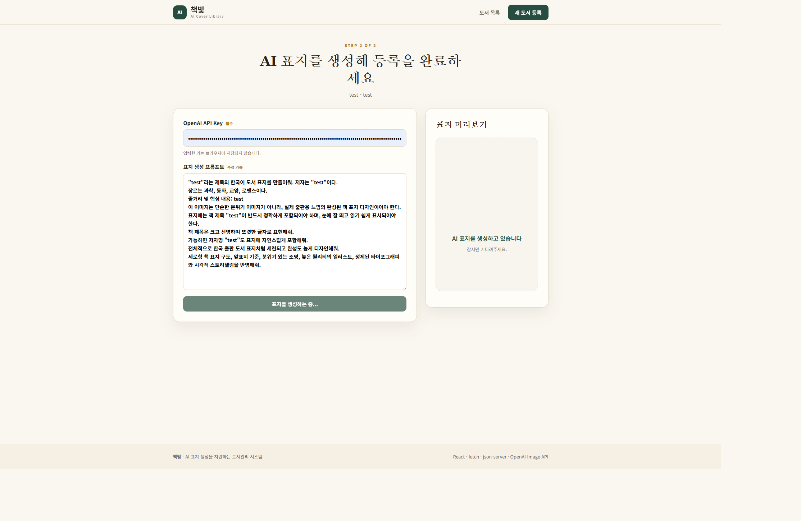
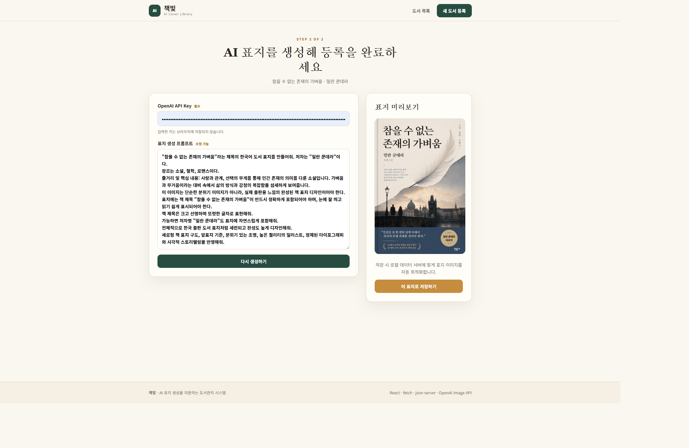
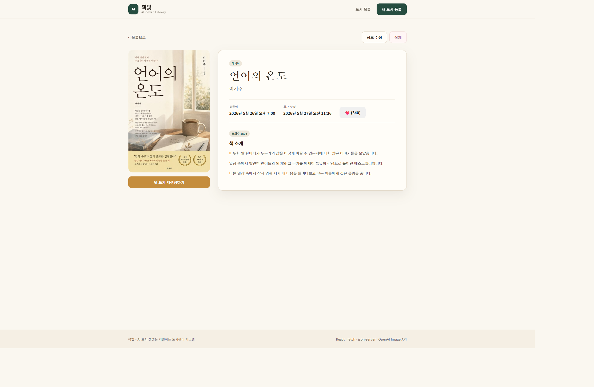

# 책빛 - AI 표지 도서관리 시스템

React에서 `fetch` 기반 CRUD를 구현하고, OpenAI Image API로 도서 표지를 생성해 저장하는 프론트엔드 프로젝트입니다. 도서를 등록하고 프롬프트를 다듬은 뒤 AI 표지를 생성하여 컬렉션에 반영하는 과정을 시연합니다.

## 주요 기능

- 도서 목록 조회, 등록, 상세 조회, 수정, 삭제
- 제목/저자 검색 및 장르 필터
- 도서 소개를 바탕으로 한 AI 표지 프롬프트 편집
- OpenAI Image API 이미지 생성, 미리보기, 저장 및 재생성
- Vercel SPA 경로 직접 접근 및 새로고침 지원

## 기술 스택

- React 19, Vite, React Router
- `json-server` 로컬 REST API 및 `db.json` 저장소
- OpenAI Image API (`gpt-image-2`)
- Vercel 정적 프론트엔드 배포

## 로컬 실행

```bash
npm install
npm start
```

`npm start`는 두 프로세스를 함께 실행합니다.

- Vite 프론트엔드: 터미널에 표시되는 개발 URL
- 도서 REST API: `http://localhost:4000/books`

브라우저에서 목록 조회, 검색/필터, CRUD, AI 표지 저장 흐름을 확인할 수 있습니다.

## Vercel 시연 준비

이 프로젝트는 Vercel에서 프론트엔드만 제공하고, 발표 노트북에서 `json-server`를 실행하는 구성입니다.

1. 발표 전에 노트북에서 `npm run server`를 실행합니다.
2. Vercel 배포 URL을 발표에 사용할 Chrome 프로필에서 엽니다.
3. 사이트가 로컬 네트워크 접근 권한을 요청하면 허용합니다.
4. 목록 조회부터 등록, AI 표지 생성, 수정, 삭제까지 한 번 리허설합니다.

최신 Chrome은 배포 사이트가 `localhost`의 서버에 접속할 때 로컬 네트워크 접근 권한을 요청할 수 있습니다. 발표 직전에 처음 허용하는 상황을 피하기 위해 미리 승인해 둡니다.

## 주요 기능 시연 흐름

### 1. 도서 목록 조회 / 검색 / 장르 필터

목록 화면에서 등록된 도서를 확인하고, 중앙에서 좋아요와 조회수 1등을 확인하고, 검색어와 장르 필터를 통해 원하는 도서를 찾을 수 있습니다.


---

### 2. 새 도서 정보 입력

새 도서 등록 화면에서 제목, 저자, 장르, 도서 소개 정보를 입력합니다.



---

### 3. OpenAI API Key 입력 및 프롬프트 수정

2단계 화면에서 발표용 OpenAI API Key를 입력하고, 도서 표지 생성을 위한 기본 프롬프트를 수정할 수 있습니다.



---

### 4. AI 표지 생성 및 저장

AI 표지를 생성한 뒤 미리보기를 확인하고, 표지를 재생성하거나 저장합니다.



---

### 5. 저장된 표지 반영 확인

상세 화면과 목록 화면에서 저장된 AI 표지가 이미지로 반영된 것을 확인할 수 있습니다.



---

### 6. 도서 관리 기능

상세 화면에서 도서 정보 수정, 표지 재생성, 도서 삭제 기능을 사용할 수 있습니다.


## API Key 및 데이터 관리

- OpenAI API Key는 생성 화면의 입력 상태에서만 사용되며 코드나 `db.json`에 저장되지 않습니다.
- 시연에는 별도의 임시 키를 사용하고 발표 후 폐기합니다.
- AI 표지는 미리보기 후 브라우저에서 저장용 JPEG Data URL로 자동 최적화되어 `coverImageUrl`에 저장됩니다. 이는 로컬 `json-server`의 요청 크기 제한 안에서 안정적으로 시연하기 위한 처리입니다.
- 시연을 다시 시작하려면 발표 전에 보관한 원본 `db.json`으로 되돌립니다.

## 명령어

```bash
npm run dev       # 프론트엔드 개발 서버
npm run server    # json-server만 실행
npm start         # 프론트엔드와 json-server 동시 실행
npm run lint      # ESLint 검사
npm run build     # 배포 빌드
npm run preview   # 빌드 결과 미리보기
```

## 데이터 형태

```json
{
  "id": "1",
  "title": "도서 제목",
  "author": "저자",
  "genre": ["소설"],
  "content": "도서 소개",
  "coverImageUrl": "data:image/jpeg;base64,...",
  "createdAt": "ISO timestamp",
  "updatedAt": "ISO timestamp",
  "views": 0,
  "likes": 0
}
```

`views`와 `likes`는 기존 데이터 호환을 위해 보존하며 이번 시연 UI에서는 변경하지 않습니다.
